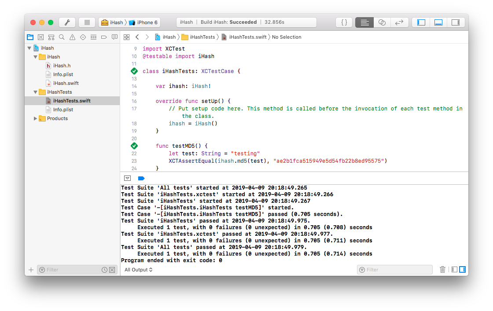

A maioria das linguagens modernas possuem soluções para distribuição de código. Por exemplo, JavaScript tem o [NPM](https://www.npmjs.com/), PHP o [Composer](https://getcomposer.org/), .NET o [Nuget](https://getcomposer.org/), entre outras. Em iOS não é diferente, a Apple possui o próprio gerenciador de tarefas chamado [Swift Package Manager](https://swift.org/package-manager/) para compartilhar e distribuir pacotes em Swift. Porém este não é muito utilizado ainda por grande parte dos desenvolvedores. A maioria opta por outros gerenciadores de tarefas não oficiais da Apple que são [CocoaPods](https://cocoapods.org/) e [Carthage](https://github.com/Carthage/Carthage), ambos open source.

Visto que estes são mais utilizados irei detalhar como é a criação e distribuição de uma biblioteca utilizando *CocoaPods*. O exemplo utilizado para estudo será uma *lib* que criptografa textos que irei chamar de *iHash*. O projeto final pode ser encontrado no [GitHub](https://github.com/felipemendes/iHash).

## Criando a biblioteca

Bibliotecas do CocoaPods utilizam o tipo *Cocoa Touch Framework*, portanto basta iniciar um novo projeto no *Xcode* com este template selecionado.


Certifique-se que o checkbox *Include Unit Tests* esteja marcado para aplicarmos os testes unitários no projeto.


Crie um novo arquivo *.swift* com o nome *iHash* dentro do target de mesmo nome. Este arquivo irá conter o comportamento básico da biblioteca. O comportamento é muito simple e possui apenas uma função para gerar o valor *MD5* de uma *string* informada.

Conteúdo do arquivo *iHash.swift*:

```swift
import Foundation
import CommonCrypto

public final class iHash {
    
    public func md5(_ string: String) -> String? {
        let length = Int(CC_MD5_DIGEST_LENGTH)
        var digest = [UInt8](repeating: 0, count: length)
        
        if let d = string.data(using: String.Encoding.utf8) {
            _ = d.withUnsafeBytes { (body: UnsafePointer<UInt8>) in
                CC_MD5(body, CC_LONG(d.count), &digest)
            }
        }
        
        return (0..<length).reduce("") {
            $0 + String(format: "%02x", digest[$1])
        }
    }
}
```

A estrutura do projeto e o conteúdo do arquivo deverá ficar dessa forma:


## Criando o teste unitário

Teste de unidade é muito importante para manter o funcinamento ideal da aplicação. Portanto, vamos utilizá-lo para validar o comportamento da nossa biblioteca. No arquivo `iHashTests.swift` altere a classe com o seguinte código para testar o nosso método `md5()`:

```swift
var ihash: iHash!
    
override func setUp() {
    ihash = iHash()
}

func testMD5() {
    let test: String = "testing"
    XCTAssertEqual(ihash.md5(test), "ae2b1fca515949e5d54fb22b8ed95575")
}
```

Ao executar o teste a validação deve passar e será exibido um resumo dos métodos verificados.



## Publicando a biblioteca

Finalizado o comportamento básico da biblioteca é hora de publicá-la direto no [CocoaPods](https://cocoapods.org/.). Instale o `cocoapods` pelo terminal:

```swift
$ gem install cocoapods
```

Adicione o arquivo `podspec`. Esse arquivo é responsável por armezenar o nome, descrição, versão e informações essenciais do `pod`.

```swift
$ pod spec create iHash
```

O arquivo `iHash.podspec` será criado na raiz do projeto. Altere com informações conforme o modelo a seguir:

```
Pod::Spec.new do |spec|

  spec.name         = "iHash"
  spec.version      = "0.0.1"
  spec.summary      = "Lib that generates hash values"

  spec.description  = <<-DESC
A CocoaPods library that generates hash values
                   DESC

  spec.homepage     = "https://github.com/felipemendes/iHash"
  spec.license      = { :type => "MIT", :file => "LICENSE" }
  spec.author       = { "felipemendes" => "felipemendes@me.com" }

  spec.ios.deployment_target = "12.1"
  spec.swift_version = "4.2"

  spec.source        = { :git => "https://github.com/felipemendes/iHash.git", :tag => "#{spec.version}" }
  spec.source_files  = "iHash/**/*.{h,m,swift}"

end
```

Para validar se as informações desse arquivo estão corretas podemos executar o comando:

```
$ pod lib lint
```

Visto que utilizei o GitHub para armazenar o código e facilitar o vínculo com o CocoaPods, é necessário criar uma `tag` no repositório para distribuir o `pod`.

```
$ git tag 0.0.1
$ git push origin 0.0.1
```

Feito isso basta enviar o `pod`:

```
$ pod trunk push
```

Link para o projeto final no [GitHub](https://github.com/felipemendes/iHash).