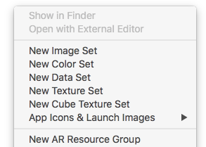

A partir da versão 9 do Xcode é possível criar e utilizar seu próprio catálogo de cores (Named Colors) no arquivo `Assets.xcassets`.  O conjunto de cores não se limita ao arquivo padrão de assets. É possível criar um novo arquivo `.xcassets` especialmente para armazenar as cores.

O uso dessa funcionalidade é suportada a partir do iOS 11.

Dessa maneira, será necessário cadastrar o código das cores uma única vez. Isso facilita eventuais alterações no código e evita que programadores definam diferentes do escopo do projeto. Para utilizar alguma cor pré-definida basta acessá-la pelo seu nome de identificação.

### Cadastrando novas cores

Com o arquivo `.xcassets` aberto na listagem dos assets aparece a opção `New Color Set` no menu de contexto.



Em seguida, você pode definir o nome e o valor da cor com o formato de preferência direto no *Attributes inspector*.


### Acessando o catálogo de cores

Uma vez nomeado a cor é possível utilizar via código da seguinte maneira:

```swift
let color = UIColor(named: "highlight")
```

A alternativa mais s
egura para acessar um conjunto de cores é primeiro validar a versão do dispositivo. Nesse exemplo foi criado uma extensão da classe `UIColor` para facilitar a utilização:

```swift
extension UIColor {
    @objc class var highlight: UIColor {
        if #available(iOS 11.0, *) {
            return UIColor(named: "highlight") ?? .purple
        } else {
            return .rgb(red: 138, green: 99, blue: 223)
        }
    }
}
```

O retorno da validação pode ser feito de outras maneira, como retornando o valor `hexString`. No exemplo criei a função `rgb` com o mesmo valor do asset.

```swift
extension UIColor {
    static func rgb(red: CGFloat, green: CGFloat, blue: CGFloat) -> UIColor {
        return UIColor.init(red: red/255, green: green/255, blue: blue/255, alpha: 1)
    }
}
```

### Muito verboso

Precisamos concordar que utilizar cores por mais prático que seja ainda é muito verboso.

Para isso temos outra maneira mais visual de obter o mesmo resultado. Ao digital `colorliteral` no seu código o Xcode irá sugestir o `Color Literal` que quando selecionado exibe um picker de cores.

Porém não é possível acessar as `Named Colors` pelo `Color Literal`. Mas o código fica mais fácil de visualizar as cores pois sua representação é totalmente visual:

