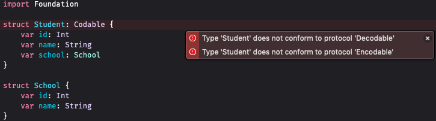

Durante o desenvolvimento de aplicativos é muito comum realizar uma comunicação com informações externas via rede. Para estabelecer esta comunicação é necessário formatar os dados tanto para enviá-los quanto para recebê-los. Em `Swift` esse processo é conhecido como **Encodable** e **Decodable**.

Segundo a documentação:

- Encodable: Um tipo que pode se **codificar para** uma representação externa.

- Decodable: Um tipo que pode **decodificar a partir** de uma representação externa.

Uma maneira de utilizar ambos protocolos em uma mesma entidade é utilizar o `alias` **Codable**. Portanto, esse tipo permite codificar e decodificar um formato diferente.

Ao informar que uma entidade conforma com estes protocolos é necessário que todas as suas propriedades também conformem com o protocolo indicado. Muitos tipos comuns do [Swift Standard Library](https://developer.apple.com/documentation/swift/swift_standard_library) e [Foundation](https://developer.apple.com/documentation/foundation) são `codable` por padrão. Quando houver um tipo customizado, é necessário que este também se conforme com o protocolo.

No exemplo a seguir podemos verificar o erro emitido pelo Xcode quando tentamos conformar o tipo `Student` com `Codable`. Como o tipo `School` não tem essa especificação, `Student` não está em total conformidade. Os demais tipo, `Int` e `String`, não geram erros pois são importados do framework `Foundation`:



## Encoding

Como vimos, o protocolo **Encodable** permite o tipo para ser enviado à uma camada externa do aplicativo. É possível codificar nossos tipos para diversos formatos, como `JSON`, `XML` e `Plist`.

Para preparar nosso tipo com o formato `JSON` podemos utilizar `JSONEncoder` da seguinte maneira:

```swift
struct Student: Codable {
    var id: Int
    var name: String
    var school: School
}

struct School: Codable {
    var name: String
}

let school = School(name: "Swift School")
let student = Student(id: 1, name: "Steve Jobs", school: school)

let encoder = JSONEncoder()
let data = try encoder.encode(student)
```

É possível visualizar como está a representação `JSON` ao converter para `String`:

```swift
print(String(data: data, encoding: .utf8)!)
```

```json
{
	"id": 1,
	"name": "Steve Jobs",
	"school": {
		"name": "Swift School"
	}
}
```

Como podemos ver, os dados são aninhados conforme estrutura declarada nas `structs`.

## Decoding

Para realizar o processo inverso, ou seja, para decodificar instâncias de um tipo de dados a partir de objeto `JSON`, podemos utilizar o `JSONDecoder`.

Nesse processo precisamos especificar o tipo para a conversão e a origem dos dados. No exemplo abaixo foi utilizado um `JSON` `hardcoded` mas a origem pode ser de qualquer lugar.

```swift
let json = """
{
    "id": 2,
    "name": "Tim Cook",
    "school": {
        "name": "Swift School"
    }
}
""".data(using: .utf8)!

let decoder = JSONDecoder()
let studentFromJson = try decoder.decode(Student.self, from: json)
```

Ao manipularmos o objeto que recebeu a decodificação podemos perceber que este possui todas as propriedades das `structs`.

```swift
print("Objeto estudante: \(studentFromJson)")
print("Nome estudante: \(studentFromJson.name)")
print("Escola do estudante: \(studentFromJson.school.name)")
```

## Chaves JSON personalizadas

Para realizar os processos de envio e recebimento das informações é necessário que as chaves dos campos estejam corretas, caso contrário, ou a `API` ou o nosso aplicativo não reconhecerá o dado trafegado.

Afim de evitar refatoração futura de campos, podemos definir **chaves de codificação personalizadas** para as propriedades. Esse processo é feito ao definir o `enum` que conforme com o protocolo `CodingKeys`:

```swift
extension Student {
    enum CodingKeys: String, CodingKey {
        case id
        case name = "nome"
        case school = "escola"
    }
}

extension School {
    enum CodingKeys: String, CodingKey {
        case name = "nome"
    }
}
```

Todos os campos da `struct` devem estar listados como `case`. Quando esse `enum` existir apenas esses `cases` que serão utilizados na codificação e decodificação, portanto, mesmo que alguma propriedade não exija mapeamento, ela deverá ser incluída.

Após estas modificações a visualização do JSON será assim:

```swift
{
	"id": 1,
	"nome": "Steve Jobs",
	"escola": {
		"nome": "Swift School"
	}
}
```

## Modificando hierarquia JSON

Também é possível alterar a hierarquia do `JSON` sem modificar nosso modelo de estrutura. Essa modificação possibilita criar hierarquias simples às mais complexas com aninhamentos.

### Encodable

Em codificação, é necessário implementar o método `encode(to:)` para especificar a estrutura. Esse processo é baseado na criação de um dicionário do tipo `KeyedEncodingContainer` para armazenar as propriedades.

O exemplo abaixo mostra a alteração para uma estrutura direta sem o aninhamento anterior:

```swift
extension Student {
    func encode(to encoder: Encoder) throws {
        var container = encoder.container(keyedBy: CodingKeys.self)
        try container.encode(name, forKey: .name)
        try container.encode(id, forKey: .id)
        try container.encode(school.name, forKey: .school)
    }
}
```

A exibição do `JSON` fica dessa forma:

```JSON
{
	"id": 1,
	"nome": "Steve Jobs",
	"escola": "Swift School"
}
```

Quando necessário aumentar o nível do aninhamento podemos utilizar o método `nestedContainer(keyedBy:forKey:)`. Para instanciar esse método é obrigatório informar um `enum` que também conforme com o protocolo `CodingKey` e também informar a chave de posicionamento do novo aninhamento.

No exemplo abaixo, alteramos o método `encode(to:)` para exibir um novo grupo de escolas:

```swift
extension Student {

    enum ​SchoolKeys: String, CodingKey {
        case best = "melhores_escolas"
    }

    func encode(to encoder: Encoder) throws {
        ...
        var schoolContainer = container.nestedContainer(keyedBy: ​SchoolKeys.self, forKey: .school)
        try schoolContainer.encode(school, forKey: .best)
    }
}
```

O resultado do `JSON` será assim:

```JSON
{
	"id": 1,
	"nome": "Steve Jobs",
	"escola": {
		"melhores_escolas": {
			"nome": "Swift School"
		}
	}
}
```

### Decodable

No processo de decodificação devemos implementar as modificações no construtor `init(from:)`. Ou seja, como este é o ponto de entrada dos dados é onde devemos modificar a estrutura.

Para recebermos a seguinte estrutura:

```JSON
{
    "id": 1,
    "nome": "Steve Jobs",
    "escola": "Swift School"
}
```

Devemos modificar a entrada dessa forma:

```swift
extension Student {
    init(from decoder: Decoder) throws {
        let container = try decoder.container(keyedBy: CodingKeys.self)
        name = try container.decode(String.self, forKey: .name)
        id = try container.decode(Int.self, forKey: .id)
        let schoolName = try container.decode(String.self, forKey: .school)
        school = School(name: schoolName)
    }
}
```

Para aumentar o nível do aninhamento na entrada dos dados pode utilizar o método `nestedContainer(keyedBy:forKey:)`:

Para adaptar à entrada do `JSON` abaixo:

```JSON
{
	"id": 1,
	"nome": "Steve Jobs",
	"escola": {
		"melhores_escolas": {
			"nome": "Swift School"
		}
	}
}
```

O `init` deve ficar dessa forma:

```swift
extension Student {
    init(from decoder: Decoder) throws {
        ...

        let schoolContainer = try container.nestedContainer(keyedBy: ​SchoolKeys.self, forKey: .school)
        school = try schoolContainer.decode(School.self, forKey: .best)
    }
}
```

## Datas com `Codable`

Pode-se dizer que, lidar com datas em programação é um sofrimento para a maiorida dos desenvolvedores. Principalmente quando é necessário trafegar datas entre cliente e servidor. O importante nesse case é atender ao fato que o envio e recebimento de datas é feito como `String`, mas para haver a comunicação, deve ser estabelecido um formatado para esta informação.

Portanto, vamos adicionar um novo campo com data ao `JSON`:

```JSON
{
	"id": 1,
    "nome": "Steve Jobs",
    "data_nascimento" : "24-02-1955",
	"escola": {
		"nome": "Swift School"
	}
}
```

Para facilitar a manipulação, podemos extender a classe `DateFormatter` com o formato de data do `JSON`. No exemplo abaixo é utilizado uma propriedade para facilitar seu reuso:

```swift
extension DateFormatter {
    static let dateFormatter: DateFormatter = {
        let formatter = DateFormatter()
        formatter.dateFormat = "dd-MM-yyyy"
        return formatter
    }()
}
```

Essa propriedade deve ser vinculada ao `JSONEncoder` e `JSONDecoder` nas propriedades `.dateEncodingStrategy` e `.dateDecodingStrategy`, respectivamente:

```swift
let encoder = JSONEncoder()
encoder.dateEncodingStrategy = .formatted(.dateFormatter)

let decoder = JSONDecoder()
decoder.dateDecodingStrategy = .formatted(.dateFormatter)
```
