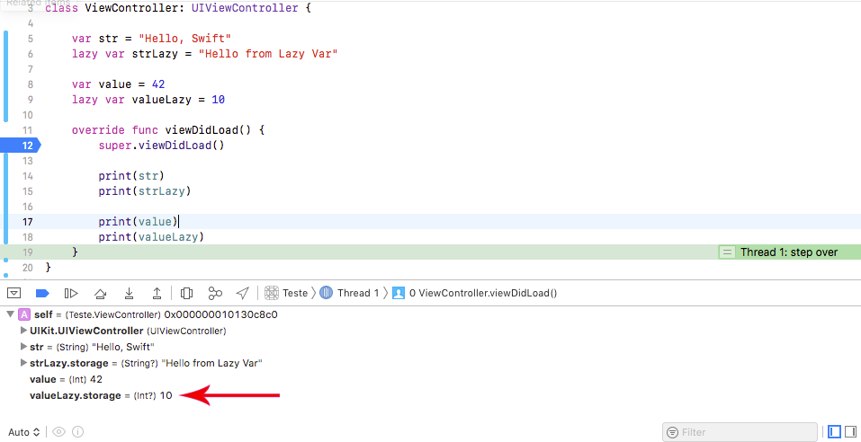
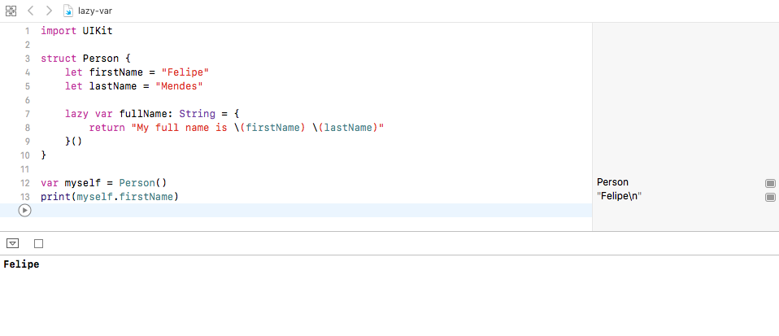

Em desenvolvimento mobile o poder de computação é muito limitado comparado à outras plataformas. Por esse motivo uma boa prática é criar objetos complexos somente quando precisamos deles.

Swift tem um mecanismo embutido na linguagem que permite o cálculo [just-in-time](https://en.wikipedia.org/wiki/Just-in-time_compilation) para tarefas mais complexas chamado de `lazy var`. Esse tipo de declaração permite que a propriedade seja executada somente quando for solicitada pela primeira vez. Se nunca for solicitada, a propriedade nunca é executada.

No exemplo abaixo foram criadas quatro variáveis, duas com o indicador `lazy` e duas sem. Um `breakpoint` foi habilitado no início da função `viewDidLoad` e quando esta é invocada **somente** as propriedades sem o indicador `lazy` são criadas. Podemos confirmar no painel Debug:

Ao avançar a execução do código, as propriedades do tipo `lazy` somente são criadas em tempo de execução.

Essa prática tem diversas utilidades e é muito comum em propriedades computadas. No exemplo abaixo a propriedade `lazy var fullName` somente será criada na memória quando invocada. E como não foi chamada no teste não houve desperdício de memória, mesmo o objeto sendo instanciado.

