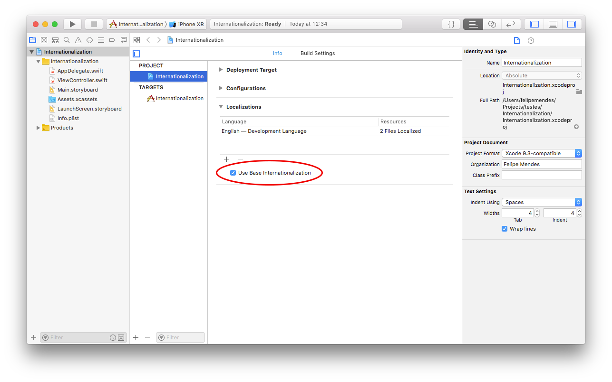
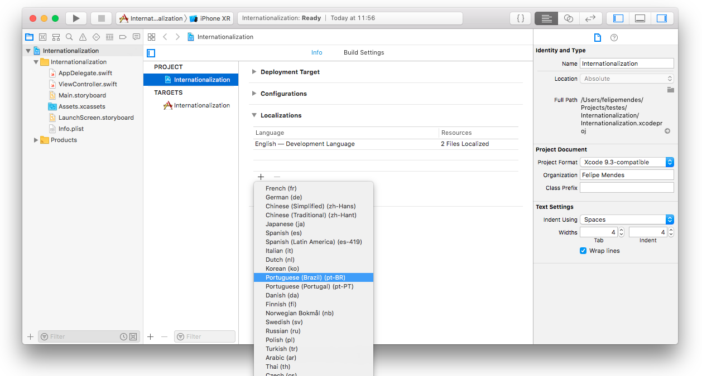
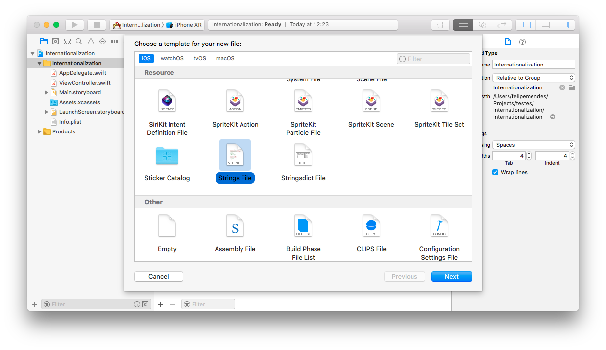
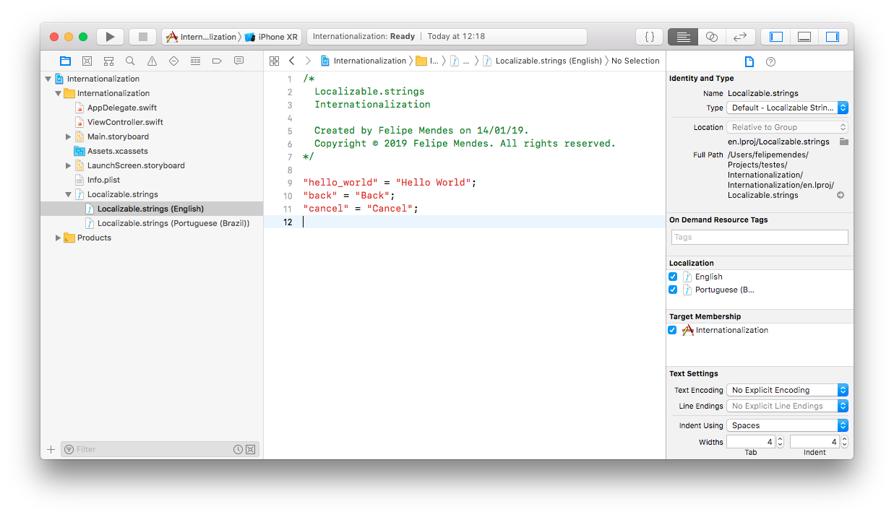

Localização é o processo para habilitar o suporte de vários idiomas no seu aplicativo. Este processo possibilita a expanção da aplicação para outras localidades. Normalmente não nos preocupamos em localizar uma aplicação, seja por ser um projeto pequeno ou simplemente não ser a proposta do projeto. Porém, situações mudam e do dia para a noite pode ser necessário levar a aplicação para outros idiomas. Refatorar código por textos de exibição não é uma tarefa fácil, rápida ou simples. Portanto, nada melhor do que preparar o projeto para eventuais mudanças de escopo.

Visto que o ingês é o idioma que as linguagens normalmente são escritas, muitos programadores adotam a língua inglesa para nomear dados no código, como funções, variáveis, etc. Dessa forma não há alteração de contexto entre o idioma da linguagem de programação com o português, por exemplo. Com isso, o uso da Localização possibilita que a aplicação seja escrita em um único idioma. Isso facilita o desenvolvimento em times que possuem pessoas com nacionalidades diferentes.

### Habilitar localização no Xcode

Por padrão, ao criar um novo projeto o Xcode já possui habilitado a opção **Use Base Internationalization**. Basta conferir se está marcado na sessão *Localizations* em *Project Navigator*. Essa opção gera automaticamente a estrutura de arquivos para a linguagem global, normalmente usa o inglês como base.



### Adicionar novos idiomas

No *Project Navigator* clique no sinal *+* em *Localizations* e selecione o novo idioma.



Será necessário selecionar quais *storyboards* que será aplicado o novo idioma.


Um novo arquivo de localização .strings será criado junto ao *Interface Builder* selecionado. Para aplicar a localização em todo o projeto é necessário criar o arquivo *Localizable.strings*. Anteriormente o Xcode gerava por padrão esse arquivo. Nas versões recentes é necessário gerá-lo manualmente. Para isso selecione **File -> New -> File..** ou o atalho **⌘N**. E na seção **Resources** dos templates selecione **Strings file**. Nomeie o arquivo como **Localizable.strings**.



Em seguida é necessário habilitar o novo idioma no arquivo de *.strings*. Selecione o arquivo **Localizable.strings**, na barra lateral **Inspectors** clique em **Localize..** na seção *Localizations*.


Na caixa de diálogo selecione o idioma padrão (*English*) e clique em **Localize**.


Agora no **Inspectors** aparece o idioma que foi adicionado no *Project Navigator*. Basta marcar todos os checkboxs dos idiomas para ser criado cada arquivo .strings.


### Adicionar localizações

Selecione o arquivo **Localizable.strings** de cada idioma e adicione as chaves e valores para cada palavra ou frase a ser localizada. Seguindo o seguinte exemplo:

```swift
"hello_world" = "Hello World";
```

Os arquivos devem possuir as mesmas chaves alterando apenas os respectivos valores de acordo com o idioma. O arquivo em *Localizable.strings (English)* ficaria dessa forma com alguns exemplos:



E o arquivo *Localizable.strings (Portuguese (Brazil))* assim:


### Utilizar localizações

O método **NSLocalizedString(key: String, comment: String)** é utilizado para acessar os valores das chaves cadastradas nos arquivos de localizações. No primeiro parâmetro `key` deve ser informado a chave e o parâmetro `comment` serve apenas para ajudar na tradução dos valores.

```swift
let welcomeTitle = NSLocalizedString("hello_world", comment: "")
```

Para facilitar o uso do método **NSLocalizedString** e deixar o código mais limpo criei uma função para apenas a chave:

```swift
func localized(_ key: String) -> String {
    return NSLocalizedString(key, comment: "")
}
```

E utilizando a função:

```swift
let welcomeTitle = localized("hello_world")
```