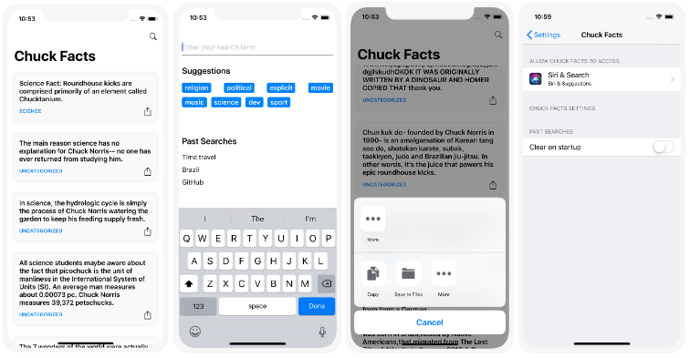

Nesta postagem, compartilho um pouco das práticas e processos que utilizei no desenvolvimento do aplicativo para iOS Chuck Facts. O código fonte está disponível no repositório [ChuckFacts](https://github.com/felipemendes/ChuckFacts).

Em resumo, o projeto possibilita realizar buscas em [api.chucknorris.io](https://api.chucknorris.io/), exibir os resultados consultados e realizar o compartilhamento dos fatos.

Existem várias maneiras de se resolver um problema. No entanto, a maneira que o problema é abordado depende muito do gosto pessoal e da situação atual do projeto. Com este post, espero que você aprenda algo útil do meu ponto de vista no desenvolvimento dessa aplicação.

Este é o resultado final:

## Iniciando

Para facilitar a identificação e divisão de tarefas, utilizei o GitHub Projects com automação dos *cards* com as *issues* do projeto. O quadro que criei se chama MLP (*Minimum Loveable Product*) e pode ser encontrado [aqui](https://github.com/felipemendes/ChuckFacts/projects/1).

## Sistema de controle de versão

Ao iniciar um novo projeto, a primeira linha de comando que sempre digito é `git init`. O sistema de controle de versão é um processo imprescindível no desenvolvimento de aplicativos e sistemas, sendo o `Git`, na minha opinião, a melhor e mais completa alternativa para trabalhar em equipes e controlar todo o processo.

## Configuração inicial

No *Xcode*, para facilitar a organização de grupos (diretórios) e arquivos, deixei o projeto configurado com o mínimo de informação possível. Isso porque tal forma de organização coloca o projeto em perspectiva, ajudando, assim, a pensar na melhor arquitetura a ser utilizada e no objetivo da aplicação. A fim de escrever um código mais limpo e facilitar o seu versionamento de, não utilizei *Storyboards* e *XIBs*. Assim, a alternativa que escolhi foi a de desenvolver as telas e elementos visuais programaticamente, isto é, por meio de *view code*.

Para facilitar o desenvolvimento de layout, utilizei o serviço [WTF Auto Layout?](https://www.wtfautolayout.com/) para deixar o *log* de erros mais legível.

## Style guide

Para melhorar a leitura e integração de novos membros ao projeto, fiz uso do *style guide* de *Swift* do [Raywenderlich](https://github.com/raywenderlich/swift-style-guide). Ferramentas de *linter* também entraram na minha receita. O uso do *[SwiftLint](https://github.com/realm/SwiftLint)* ajuda a impor um estilo de código para todos os envolvidos e promove as melhores práticas recomendadas na programação.

## Gerenciador de dependências

Nesse projeto optei em utilizar também o *Cocoapods* por ser ele um gerenciador muito fácil de configurar e de integrar novas dependências ao projeto. Destaco, ainda, que seu uso também é muito simplificado tanto para a integração de dependência quanto para a construção de novas bibliotecas, conforme explico [nesta](https://felipemendes.netlify.com/bibliotecas-com-cocoapods/bibliotecas-com-cocoapods/) postagem.

## Arquitetura

Tentei organizar ao máximo o código por *módulos/features*, uma vez que facilita a identificação de códigos relacionados para correção e adição de novos recursos no futuro de uma maneira mais simplificada. Essa organização responde à pergunta “O que esse aplicativo faz?” em vez de “O que é esse arquivo ou o que ele faz?”. O maior benefício é tornar tudo modular e facilitar o seu desenvolvimento, bem como seus respectivos testes.

Aqui foram criadas as *features* e *components*:

- Home;
- Search;
- CloudTag;
- PastSearches;
- Placeholder.

## MVVM

Existem diversas maneiras para arquiteturar um aplicativo, sendo o *MVC (Model View Controller)* da Apple mais usado no desenvolvimento iOS. Esse modelo é popularmente conhecido como *Massive View Controller* por causa de sua falta de abstração. Dessa forma, objetivando de resolver essa questão, escolhi utilizar o *MVVM (Model-View-ViewModel)*. O uso do *MVVM* permite tirar parte da lógica de apresentação da *ViewController* e, consequentemente, facilitar a manutenção do código e evolução de um projeto.

## FlowController

Semelhante ao padrão *Coordinator*, o *FlowController* tem como propósito fornecer um encapsulamento da lógica de navegação. Desse modo, forma as *ViewControllers* ficam isoladas e invisíveis entre si, o que possibilita o reuso mais fácil. Basicamente, o *FlowController* é um container de *ViewControllers* para resolver um fluxo de navegação interno. Normalmente, utilizo um *Flow* para cada *feature*, de modo que cada ação possui um método próprio para realizar a navegação.

## Injeção de dependência

Cada *ViewController*, dentro do *FlowController*, pode ter dependências diferentes. Isso evita que o primeiro *ViewController* carregue todas as instâncias (ex.: um serviço) e passe para as *ViewControllers* filhas. Para ajudar a divisão de componentes que serão desenvolvidas, testadas e mantidas com mais facilidade, utilizei o [Swinject](https://github.com/Swinject/Swinject) como framework de Injeção de Dependência.

## Testes unitários

Para os *unit tests* utilizei somente o framework *XCTest* da Apple. Para cada componente que foi testado foi criado um arquivo de *XCTest* no *target* de testes. Recomenda-se criar uma função para cada comportamento, bem como ser o mais minucioso na descrição da assinatura de cada método. Por outro lado, apesar de não ser aconselhado, também criei testes de requisições dos *endpoints* de produção. O ideal seria realizar os testes em um ambiente de homologação.

## Camada de serviços

A implementação de serviços normalmente gera dúvidas sobre qual abordagem deve ser seguida: utilizar bibliotecas externas, como Moya e Alamofire, ou desenvolver manualmente? Por mais que essas *libs* sejam acessíveis e sejam de uso simplificado, tentei limitar a quantidade de dependências na aplicação e assim evitar problemas com atualizações ou erros de códigos externos.

As requisições ficaram organizadas da seguinte maneira:

- **Endpointable** é um protocolo que possui as propriedades necessárias para a criação da *URLRequest*.
- **HTTPMethod** é um *enum* responsável pelos métodos de requisição HTTP. Nesse caso, somente o tipo *get* foi configurado.
- **HTTPTask** é um *enum* que configura os parâmetros dos *endpoints* dos serviços.
- **Routable** este protocolo possui um *endpointable* responsável por fazer as requisições e o método *request()* retorna o seu resultado.
- **Router** cria uma *URLSession* a partir do *endpointable*. O retorno da requisição é enviado para *URLSession.shared*. Aqui, também é feito o *encoding* dos parâmetros na URL.

## Armazenamento de dados

Por fim, para a persistência dos dados, utilizei o framework *CoreData* da Apple. Criei o gerenciamento e a manipulação básica de objetos devido ao tipo de dados que estão salvos. O armazenamento ocorre somente para as pesquisas realizadas pelo usuário. A cada pesquisa realizada, a função *add(_ keyword: String)* é invocada, de modo que toda a lógica é realizada e o armazenamento é feito, se necessário. A recuperação desses dados, por sua vez, foi feita por meio de *observable*. A exclusão dos registros se deu por intermédio das configurações do aplicativo dentro de Ajustes do prórpio iOS.