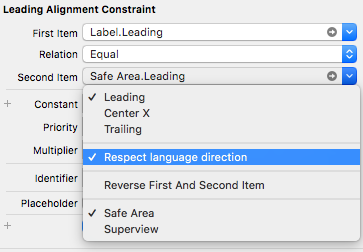

Durante o desenvolvimento de `constraints` no iOS, uma dúvida muito comum é quais âncoras devemos utilizar na criação de `layout` horizontal. A maioria das convenções e documentação oficial nos orientam muito bem. Porém, em alguns casos não encontramos respostas para escolher uma melhor abordagem. Esse é o caso das variações do `NSLayoutXAxisAnchor`.

## NSLayoutXAxisAnchor

O `NSLayoutXAxisAnchor` é uma `API` do `UIKit` que nos auxilia na criação de `constraints` de `layout` horizontal. É aqui onde estão declaradas as variáveis de âncoras: `centerXAnchor`, `leftAnchor`, `leadingAnchor`, `rightAnchor` e `trailingAnchor`.

É exatamente a diferença entre `leftAnchor` com `leadingAnchor` e `rightAnchor` com `trailingAnchor` que surgem as dúvidas. E na documentação encontramos uma informação genérica para ambos os lados.

## Variações de layout

Os valores `leftAnchor` e `rightAnchor` são absolutos e sempre irão se referir aos lados esquerdo e direito da tela, respectivamente. Enquanto, `leadingAnchor` e `trailingAnchor` são afetados pela localização do aparelho.

A localização do device é referente a direção de leitura do idioma. Ou seja, para idiomas que utilizam um sistema de escrita da direita para esquerda, como árabe, hebraico e persa, tanto `leadingAnchor` quanto `trailingAnchor` adaptarão a tela corretamente para estes usuários.

Segundo o vídeo [Mysteries of Auto Layout, Part 1](https://developer.apple.com/videos/play/wwdc2015/218/?time=2086) da WWDC 2015, recomenda-se utilizar `leading`, `trailing` ao invés de `left`, `right`. A não ser que haja algum motivo específico no escopo do projeto.

Ainda nesse vídeo sugere-se a adotar um padrão entre as variações no mesmo projeto. Pois, caso o ambiente mude não teremos conflitos de `constraints` e de visualização de tela.

## Exemplo

No desenvolvimento de `layout` via código podemos seguir esse padrão:

```swift
anyLabel.leadingAnchor.constraint(equalTo: view.leadingAnchor).isActive = true
```

Para `layouts` via `interface builder` (`Storyboard` ou `.xib`), o `Xcode` por padrão mantem habilitado para seguir as orientações do idioma, que é a recomendação. Mas caso ocorra a necessidade, para desabilitar essa opção, basta editar a `constraint` e desmarcar `Respect language direction` no item desejado, conforme a imagem:

