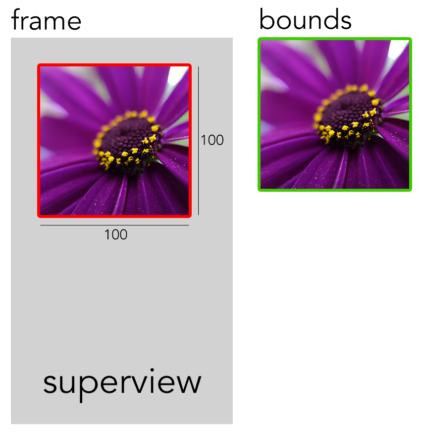

Essa é uma dúvida que sempre desenvolvedores normalmente têm durante o desenvolvimento de algum projeto. De forma resumida podemos definir *Frame* e *Bounds* da seguinte maneira:

- *Frame*: é o espaço, expresso por uma posição (x e y) e um tamanho (largura e altura), **relativo à *View* superior (*superview*) onde está contido**.

- *Bounds*: é o espaço, expresso por uma posição (x e y) e um tamanho (largura e altura), **relativo ao seu próprio tamanho**.

A imagem abaixo demonstra uma tela que possui uma imagem com tamanho de 100x100 (largura e altura) posicionada à 25,25 (x e y):



Como podemos notar, **frame** é o espaço considerando a *View* superior (*superview*) e **bounds** é o espaço da imagem isolada.

O código abaixo exibe os valores de *frame* e *bounds* desse exemplo:

```swift
    override func viewDidLoad() {
        super.viewDidLoad()
        
        print("frame.origin.x: \(myImage.frame.origin.x)");
        print("frame.origin.y: \(myImage.frame.origin.y)");
        print("frame.size.width: \(myImage.frame.size.width)");
        print("frame.size.height: \(myImage.frame.size.height)");

        print("bounds.origin.x: \(myImage.bounds.origin.x)");
        print("bounds.origin.y: \(myImage.bounds.origin.y)");
        print("bounds.size.width: \(myImage.bounds.size.width)");
        print("bounds.size.height: \(myImage.bounds.size.height)");
        
    }
```

A seguinte informação é exibida:

```
frame.origin.x: 25.0
frame.origin.y: 25.0
frame.size.width: 100.0
frame.size.height: 100.0

bounds.origin.x: 0.0
bounds.origin.y: 0.0
bounds.size.width: 100.0
bounds.size.height: 100.0
```