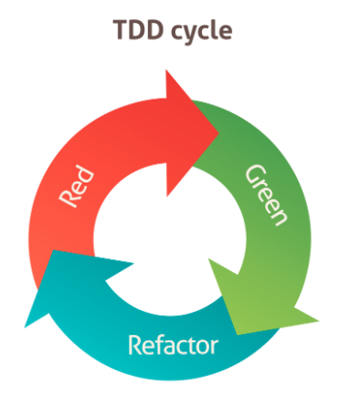

Desenvolvimento guiado por testes, ou **Test Driven Development**, é uma técnica de programação muito comum em equipes que almejam uma cobertura de teste em seus códigos e minimizar as chances de erros, bem como comportamentos inesperados. Neste texto, irei abordar o conceito de **TDD** e como utilizo esta técnica em meus projetos.

Testes em geral visam reduzir o tempo de desenvolvimento e garantir a funcionalidade do código em futuras adaptações. O principal empecilho, pelo menos pra mim, é mudar a rotina de desenvolvimento para utilizar testes.

## O que é TDD?

O conceito de TDD se resume em escrever um teste antes do seu código existir. Primeiro deve-se escrever um teste com falha e em seguida adicionar o mínimo de código necessário para validá-lo. Quando o teste for executado com sucesso a próxima etapa é refatorar tanto o código quanto o teste. Após a refatoração, o comportamento de ambos deve permanecer idêntico.

Esse processo quando executado de forma correta permite que todo o aplicativo esteja coberto por testes. Assim não será necessário gastar tempo extra adicionando testes posteriormente e teremos a confiança no comportamento do código. Vale ressaltar que o `Code Coverage` não é um indicador que o código é confiável. A cobertura do código indica apenas quais trechos de código foram testados, a qualidade do teste é responsabilidade do desenvolvedor.

### Ciclo *Red-Green-Refactor*

<div style="text-align:center"></div>

Essas etapas comuns em **TDD** são conhecidas como *Red-Green-Refactor*:

1. Red: Escrever um teste com falha
2. Green: Escrever a quantidade mínima necessária para validá-lo
3. Refactor: Refatorar tanto o código quanto o teste

## Etapas do TDD

Iniciar testes com **TDD** pode aparentar um tanto ou quanto abstrato ter que criar um teste para um código que ainda não existe. Há diversas especifícações que nos ajudam nesta etapa. Uma solução adotada por muitos desenvolvedores é estruturar os testes com as fases do conceito de [Given-When-Then](https://martinfowler.com/bliki/GivenWhenThen.html).

### Given-When-Then

Essa solução facilita a leitura e cria uma padronização aos nossos testes:

#### Given

Aqui deve ser definido os dados necessários para a construção do nosso cenário. As instâncias devem ser *mockadas* para facilitar a especificação do cenário almejado. Ou seja, essa etapa contém todos os pré-requisitos para a execução do teste.

#### When

É a etapa onde o comportamento do teste é invocado. Aqui devemos informar o método que deverá ser testado.

#### Then

Na última etapa deve ser definido o objetivo esperado do comportamento. Podemos verificar o retorno da declaração informada. 

## Como aplicar

Vamos utilizar o **TDD** para criar uma validação de e-mails. O método a ser testado deve retornar um *boolean* a partir do texto fornecido como argumento. Neste exemplo, usarei o *framework XCTest* de testes unitários da *Apple*.

Cada comportamento deve ser testado individualmente. Portanto, vamos primeiro testar o caso de sucesso para o e-mail fornecido. Aplicando a estrutura do **TDD** nosso método deverá ter esta organização:

```swift
class SampleAppTests: XCTestCase {
    func test_email_is_valid() {
        // Given

        // When

        // Then
    }
}
```

Como ainda não temos nenhum código criado devemos começar criando a assinatura do método na etapa **When**. Dessa forma, para validar um e-mail precisamos criar a chamada do método recebendo um valor como argumento. Em **Given** podemos isolar o e-mail que será validado:

```swift
func test_email_is_valid() {
    // Given
    let email = "email"

    // When
    sut.isValid(email)

    // Then
}
```

> A sigla **SUT** signifca *System Under Test* e é muito comum utiliza-lá para se referir à classe que estamos testando.

Com este código o *Xcode* exibirá um erro no identificador *sut*. Nosso *sut* será a classe que irá conter o método *isValid()*. Vamos especificar o nome da classe de teste na etapa **Given**:

```swift
func test_email_is_valid() {
    // Given
    let sut = EmailValidator()
    let email = "email"

    // When
    sut.isValid(email)

    // Then
}
```

Para resolver este erro devemos construir nossa classe. A criação de classes e objetos necessários para o testes podem ser criados no mesmo arquivo pois o primeiro objetivo é fazer nosso teste ser validado.

O código suficiente pode ser *hardcoded* e sem regras, precisamos apenas instânciar a classe e invocar nosso método:

```swift
final public class EmailValidator {
    public func isValid(_ email: String) -> Bool {
        return true
    }
}
```

Em seguida vamos definir o objetivo do teste na etapa **Then**. Como nosso método retornará um *boolean* indicando se o e-mail é válido podemos verificar se o retorno é verdadeiro através de um *assert*. E para facilitar a leitura podemos associar o retorno à uma constante:

```swift
func test_email_is_valid() {
    // Given
    let sut = EmailValidator()
    let email = "email"

    // When
    let validate = sut.isValid(email)

    // Then
    XCTAssertTrue(validate)
}
```

Ao executar o teste agora o *Xcode* retornará sucesso.

Teste validado a próxima etapa é refator o código que verifica a entrada informada. O exemplo abaixo realiza a validação de e-mail com *regex*. Mais detalhes sobre esse padrão [aqui](https://emailregex.com).

```swift
final public class EmailValidator {
    private let pattern = "[A-Z0-9a-z._%+-]+@[A-Za-z0-9.-]+\\.[A-Za-z]{2,64}"

    public func isValid(_ email: String) -> Bool {
        let range = NSRange(location: 0, length: email.utf16.count)
        let regex = try? NSRegularExpression(pattern: pattern)
        return regex?.firstMatch(in: email, options: [], range: range) != nil
    }
}
```

Com esse trecho de código nosso *XCTAssertTrue* retornará *false* pois a constante do e-mail não é uma entrada válida. Basta substituir por um e-mail verdadeiro e verificar a validação:

```swift
func test_email_is_valid() {
    // Given
    let sut = EmailValidator()
    let email = "nome@email.com"

    // When
    let validate = sut.isValid(email)

    // Then
    XCTAssertTrue(validate)
}
```

Este exemplo é um pouco sobre o processo de **TDD** e como pode ser aplicado em aplicações *iOS*.